# VoxNote

VoxNote is a desktop application for Windows that records speech from a
microphone, turns it into text with a speech recognition model that runs
**entirely on your own computer**, and saves the transcript as a document.

```
Microphone -> Voice activity detection -> Speech recognition -> Transcript -> File
```

VoxNote writes down what was said, in the language it was said in. It does
not correct grammar, translate, paraphrase or analyse the text. If you want
feedback on your speaking, export the transcript and give it to the tool of
your choice.

> **Project status: 0.6.0, pre-release.** The application and its Windows
> installer have been built and tested by the developer on one Windows 11
> machine. The installer is **not code-signed**, so Windows blocks or warns
> about it on other computers; see
> [docs/RELEASE.md](docs/RELEASE.md#distribution-without-security-warnings). See
> [Known limitations](#known-limitations) and [docs/RELEASE.md](docs/RELEASE.md).

## Contents

- [Features](#features)
- [Spoken languages](#spoken-languages)
- [Screenshots](#screenshots)
- [Supported operating systems](#supported-operating-systems)
- [Hardware recommendations](#hardware-recommendations)
- [Installation summary](#installation-summary)
- [Quick start](#quick-start)
- [Export formats](#export-formats)
- [Privacy model](#privacy-model)
- [Known limitations](#known-limitations)
- [Documentation](#documentation)
- [Development](#development)
- [License](#license)

## Features

- **Local speech recognition** with [faster-whisper](https://github.com/SYSTRAN/faster-whisper)
  and multilingual Whisper models. No account, no subscription, no cloud
  service.
- **Four models to choose from:** Large v3 Turbo (default), Large v3, Medium
  and Small.
- **Works offline** after the chosen model has been downloaded once
  (0.5 to 1.6 GB).
- **Tools for better accuracy:** limit recognition to the languages you
  actually speak, and list names or special terms that should be recognised
  reliably.
- **Voice activity detection** (Silero VAD): silence and background noise are
  not sent to the recogniser, so pauses do not produce invented text.
- **Multilingual sessions.** The model transcribes 99 languages, among them
  English, German, French, Spanish, Italian, Russian and Turkish. The language
  is detected separately for every utterance, so you can switch languages
  within one recording. The detected languages are listed on screen and in
  the exported file. See [Spoken languages](#spoken-languages).
- **Faithful transcripts.** The recognised text is stored as it is. No
  grammar correction, no translation, no rewriting.
- **Five export formats:** Markdown, plain text, JSON, Microsoft Word (DOCX)
  and PDF, all with full Unicode support.
- **You decide what a document contains:** one line per sentence or one
  continuous paragraph; with or without timestamps, language headings, title
  and each metadata row (date, languages, duration, session ID, model). The
  choice can be changed at any time, also during a recording.
- **Automatic saving, or ask first:** by default the transcript is saved when
  the recording ends; switch this off and VoxNote asks whether to save, save
  elsewhere or discard.
- **You decide where files go:** selectable save folder, configurable file
  name template with live preview, and automatic handling of name collisions
  (existing files are never overwritten).
- **NVIDIA GPU acceleration** (CUDA, FP16) when available, with automatic
  fallback to the CPU. The device in use is always shown.
- **Nothing gets lost.** If saving fails, the transcript stays available and
  can be saved elsewhere. If the application or computer crashes, the
  transcript recorded so far is offered for recovery on the next start.
- **Interface in six languages:** English (default), Turkish, German, French,
  Italian and Russian. The interface language is independent of the language
  you speak.
- **Built-in help** with a five-step introduction (shown once on first
  start), answers to common questions and an About page.
- **Edge bar:** a small bar that waits at the screen edge and slides out when
  the pointer touches it, to start and stop recording without opening the
  window.
- **Global shortcut:** `Ctrl+Alt+R` starts and stops recording from any
  application; `Ctrl+Alt+V` on the installed shortcut starts VoxNote or
  brings it to the front.
- **Light, dark or system appearance**, switchable with one click or `Ctrl+T`.
- **Keyboard shortcuts** for every main action, tooltips and icons.
- **Windows installer** with Start menu and desktop shortcuts.

## Spoken languages

VoxNote is not limited to one or two languages. The Whisper models are
multilingual, and VoxNote lets it decide the language separately for every
utterance. You do not select a language anywhere: just speak.

A single session can therefore look like this:

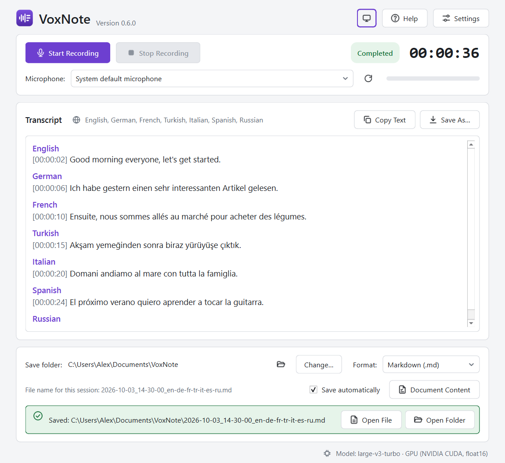

and is exported like this (Markdown):

```markdown
# Speaking Session

- Date: 2026-10-03 14:30:00
- Languages: English, German, French, Turkish, Italian, Spanish, Russian
- Duration: 00:00:36
- Session ID: 3f9a1c2e
- Model: Whisper large-v3-turbo (faster-whisper)

## Transcript

### English

[00:00:01] Good morning everyone, let's get started.

### German

[00:00:05] Ich habe gestern einen sehr interessanten Artikel gelesen.

### French

[00:00:10] Ensuite, nous sommes allés au marché pour acheter des légumes.

### Turkish

[00:00:15] Akşam yemeğinden sonra biraz yürüyüşe çıktık.

### Italian

[00:00:19] Domani andiamo al mare con tutta la famiglia.

### Spanish

[00:00:24] El próximo verano quiero aprender a tocar la guitarra.

### Russian

[00:00:28] Вчера вечером мы долго гуляли по городу.
```

The picture and the listing above use fixed sample sentences to show how
language blocks are presented; they are not the output of a recognition run.

**Languages the model can transcribe (99):**
Afrikaans, Albanian, Amharic, Arabic, Armenian, Assamese, Azerbaijani,
Bashkir, Basque, Belarusian, Bengali, Bosnian, Breton, Bulgarian, Burmese,
Catalan, Chinese, Croatian, Czech, Danish, Dutch, English, Estonian, Faroese,
Finnish, French, Galician, Georgian, German, Greek, Gujarati, Haitian Creole,
Hausa, Hawaiian, Hebrew, Hindi, Hungarian, Icelandic, Indonesian, Italian,
Japanese, Javanese, Kannada, Kazakh, Khmer, Korean, Lao, Latin, Latvian,
Lingala, Lithuanian, Luxembourgish, Macedonian, Malagasy, Malay, Malayalam,
Maltese, Maori, Marathi, Mongolian, Nepali, Norwegian, Norwegian Nynorsk,
Occitan, Pashto, Persian, Polish, Portuguese, Punjabi, Romanian, Russian,
Sanskrit, Serbian, Shona, Sindhi, Sinhala, Slovak, Slovenian, Somali,
Spanish, Sundanese, Swahili, Swedish, Tagalog, Tajik, Tamil, Tatar, Telugu,
Thai, Tibetan, Turkish, Turkmen, Ukrainian, Urdu, Uzbek, Vietnamese, Welsh,
Yiddish, Yoruba.

What to expect:

- **Accuracy differs a lot between languages.** Widely spoken languages such
  as English, Spanish, German, French, Italian, Portuguese, Russian, Turkish,
  Japanese or Chinese are recognised far better than languages for which the
  model saw little training data.
- **Tested so far:** the developer verified the complete pipeline with
  English and Turkish speech, including switching between them in one
  recording. Other languages rely on the model's multilingual ability and
  have not been tested individually with VoxNote yet. Reports are welcome.
- **Switch languages between sentences, not inside them.** The language is
  chosen per utterance; make a short pause when you change language.
- **Tell VoxNote which languages you speak.** In **Settings › Recognition ›
  Spoken languages** you can tick, for example, English and Turkish. Short
  phrases are then no longer mistaken for unrelated languages.
- The interface language of the application (six languages) is a separate
  setting and has nothing to do with the languages you can speak.

## Screenshots

The images below are rendered from the real application windows by
[`tools/make_screenshots.py`](tools/make_screenshots.py). The transcript shown
in them is fixed sample text, not the result of a recognition run.

| Ready | Recording |
| --- | --- |
| 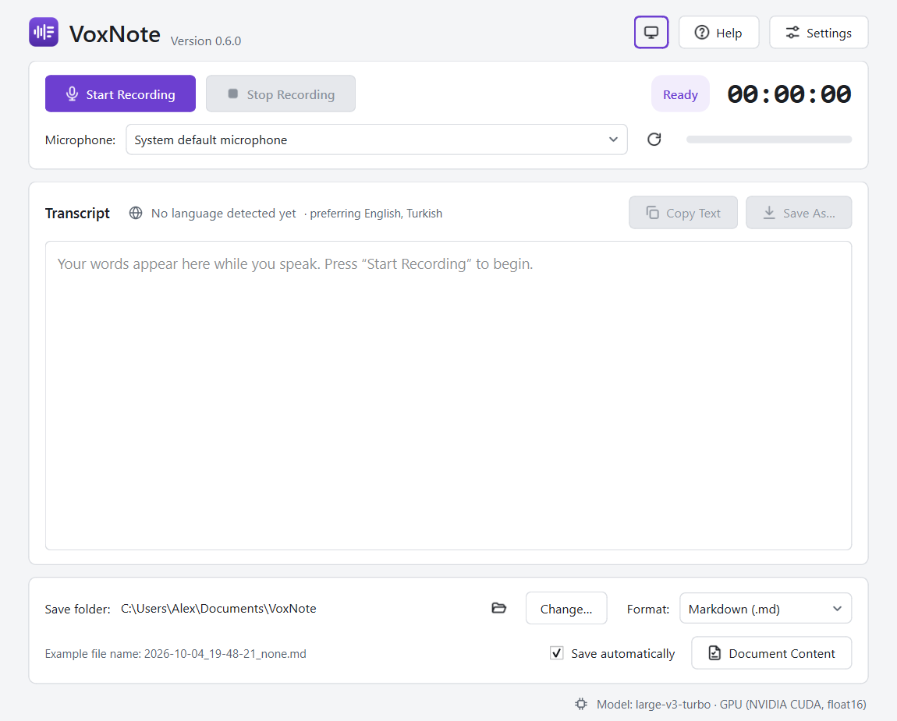 |  |

| Completed | Settings: General |
| --- | --- |
| 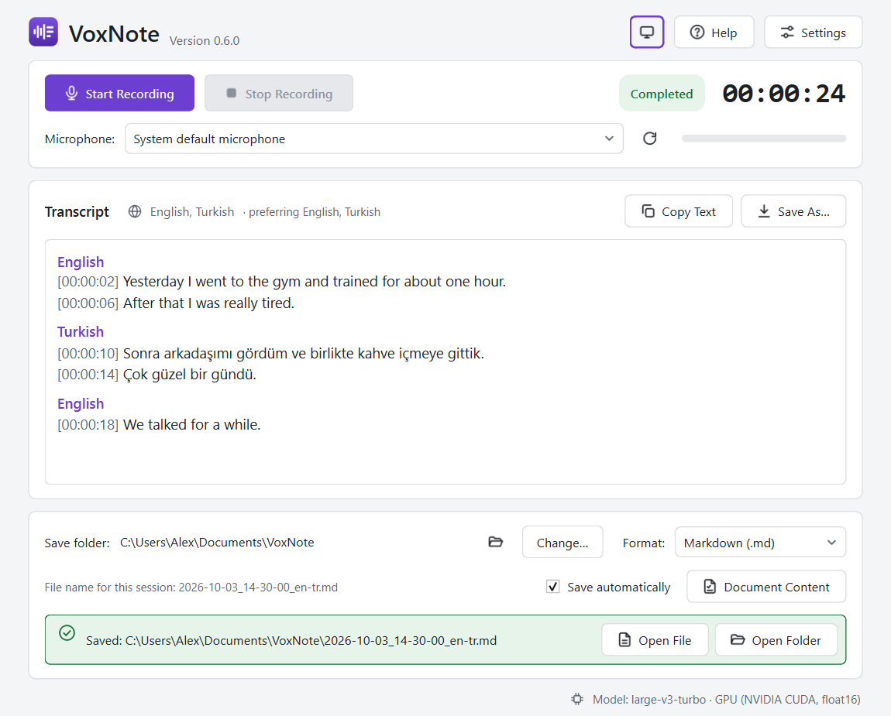 | 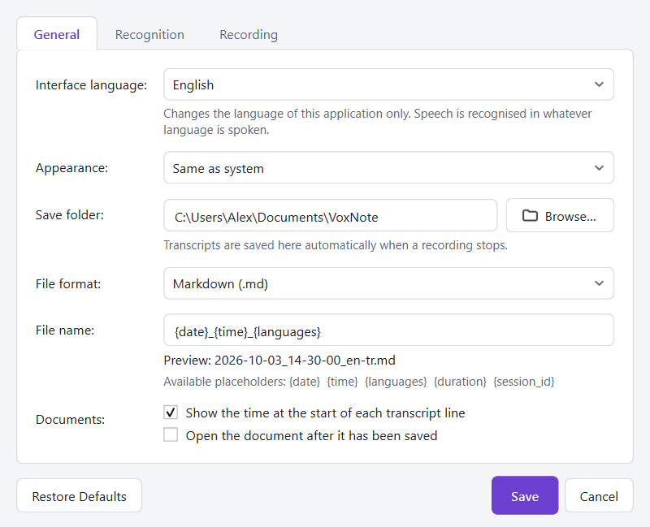 |

| Settings: Recognition | Settings: Recording |
| --- | --- |
| 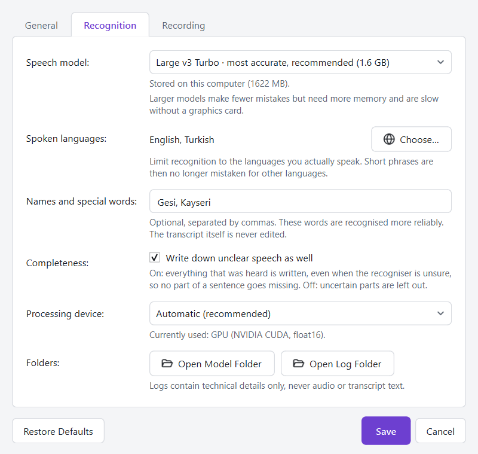 | 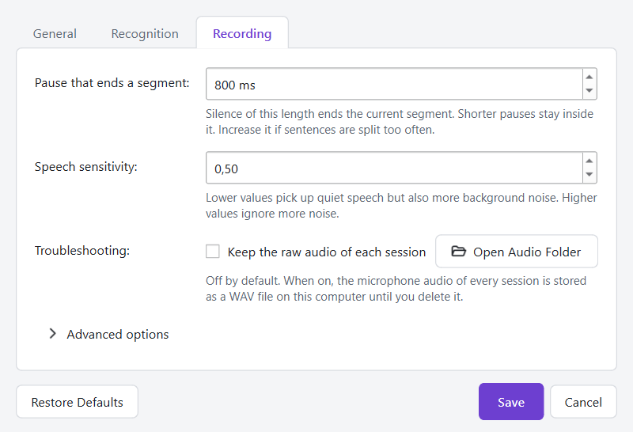 |

| Document content | Edge bar |
| --- | --- |
| 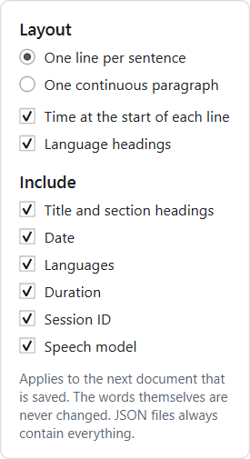 |  |

| Help: Getting Started | Help: Questions and Answers |
| --- | --- |
| 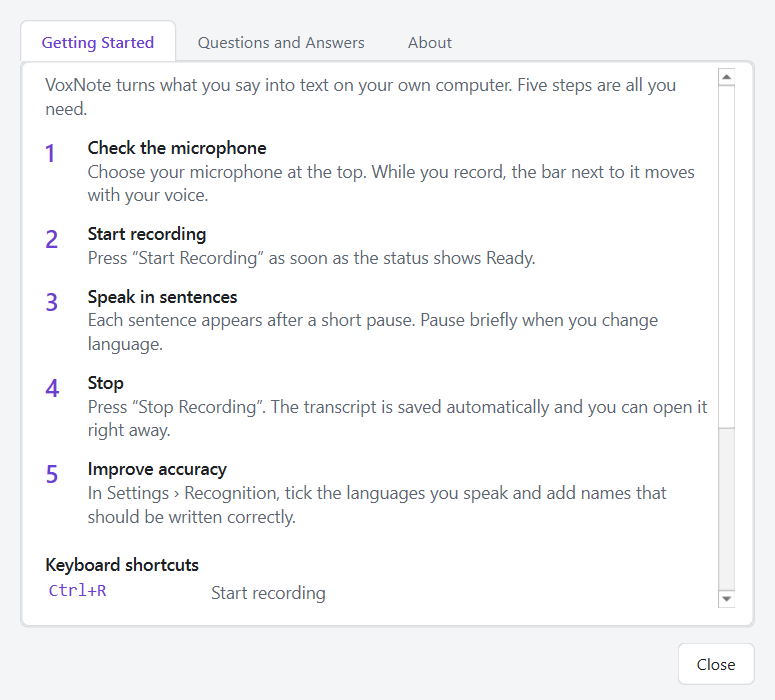 | 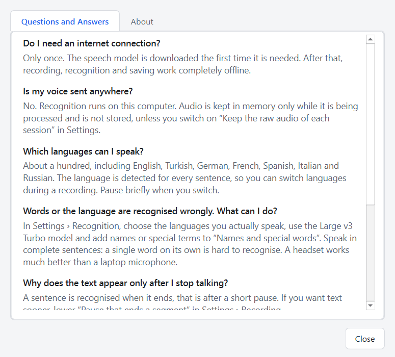 |

| Turkish interface | German interface |
| --- | --- |
| 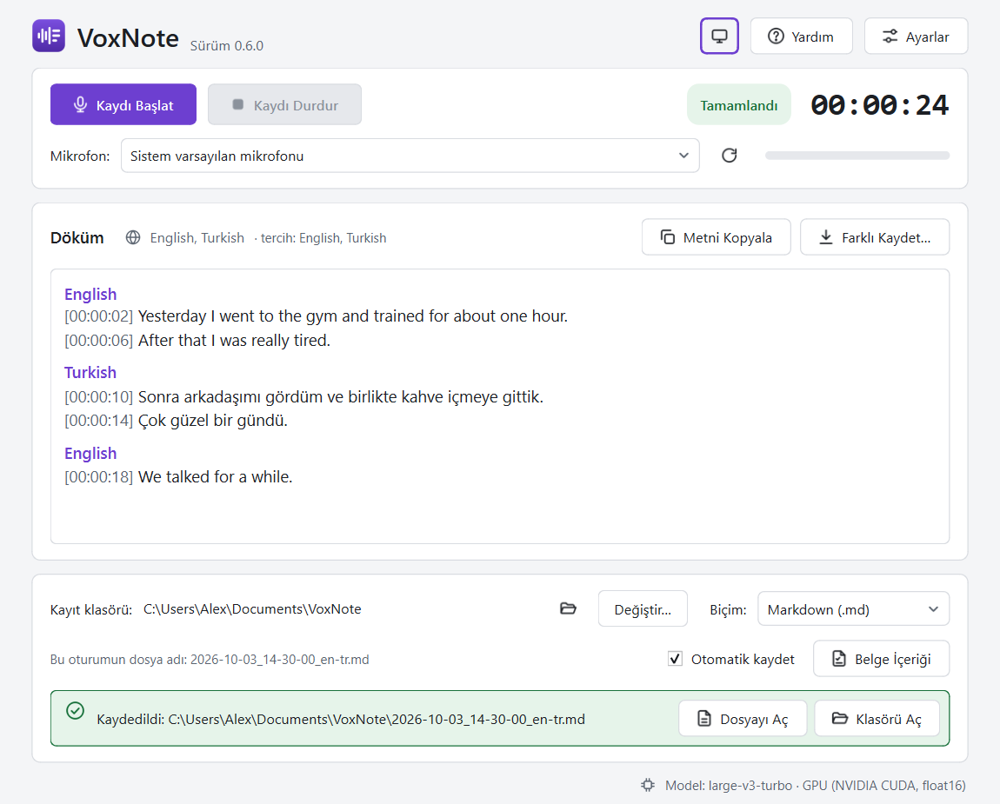 | 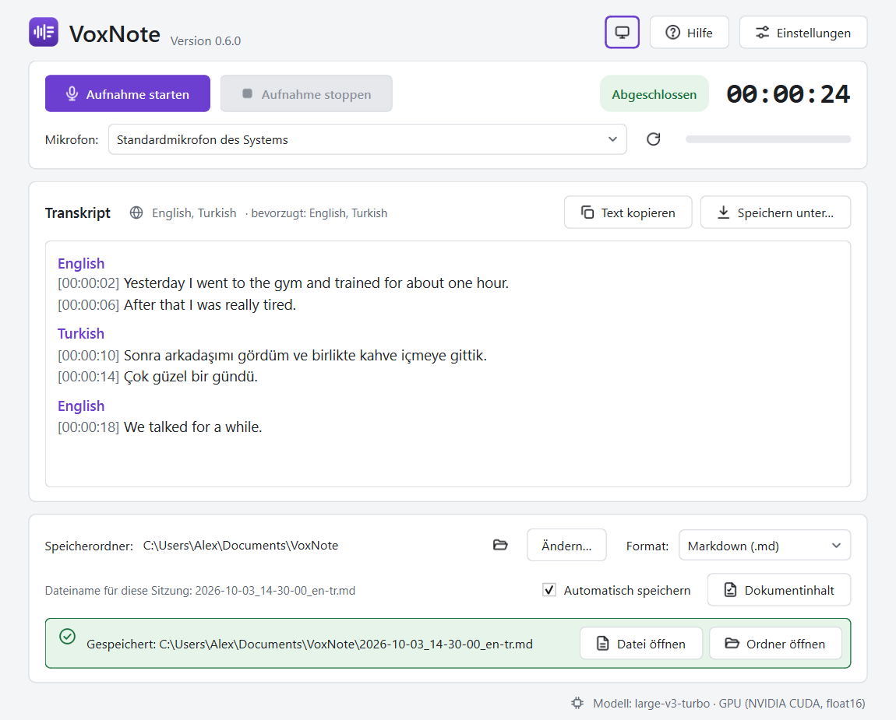 |

| Maximised window | |
| --- | --- |
|  | The content keeps a maximum width on large screens. |

| Dark appearance | Many languages in one session |
| --- | --- |
| 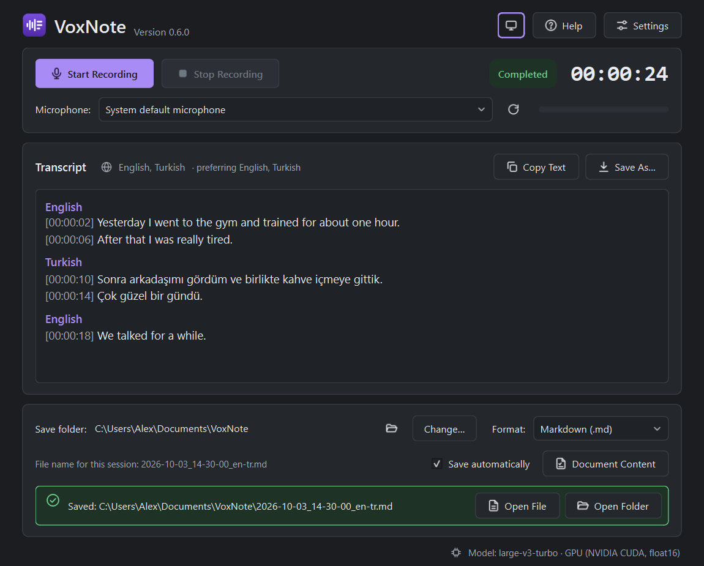 |  |

## Supported operating systems

| System | Status |
| --- | --- |
| Windows 11 (64-bit) | Primary platform. Developed and tested here. |
| Windows 10 (64-bit) | Expected to work; not tested yet. |
| Linux, macOS | Not supported. The code avoids Windows-only assumptions where practical, but nothing has been tested on these systems. |

## Hardware recommendations

| | Minimum | Recommended |
| --- | --- | --- |
| Processor | 64-bit, 4 cores | 6 or more cores |
| Memory | 8 GB | 16 GB |
| Graphics card | none (CPU mode) | NVIDIA GPU with CUDA 12 support and 4 GB or more VRAM |
| Disk space | about 3 GB (application, dependencies and the default model) | add about 1.5 GB for the optional GPU libraries |
| Microphone | any input device Windows recognises | a headset or external microphone |

The application was developed on a laptop with an NVIDIA RTX 3060 (6 GB
VRAM), 16 GB RAM and Windows 11. No performance figures are promised: speed
depends on the hardware. VoxNote logs how long each utterance took to
recognise, so you can measure it on your own machine (see
[docs/TROUBLESHOOTING.md](docs/TROUBLESHOOTING.md#reading-the-log-file)).

## Installation summary

**With the installer:** run `VoxNote-Setup-<version>.exe`. It installs for the
current user without administrator rights and creates Start menu and desktop
shortcuts. The installer is built with `tools\build_release.ps1`
(see [docs/RELEASE.md](docs/RELEASE.md)). **It is not code-signed:** Windows
SmartScreen warns about it, and Smart App Control blocks it. Until a signed
release exists, installing from source is the reliable way.

**From source:** you need Python 3.11 (the tested version; 3.10 and 3.12 are expected to
work). In PowerShell:

```powershell
git clone https://github.com/erhanozturk2018-maker/VoxNote.git
cd VoxNote
py -3.11 -m venv .venv
.\.venv\Scripts\Activate.ps1
python -m pip install --upgrade pip
pip install -r requirements.txt
```

Optional, for NVIDIA GPU acceleration (about 1.2 GB download):

```powershell
pip install -r requirements-gpu.txt
```

Full instructions, including GPU requirements and first-run behaviour, are in
[docs/INSTALLATION.md](docs/INSTALLATION.md).

## Quick start

```powershell
.\.venv\Scripts\Activate.ps1
python main.py
```

1. On the first start the speech model is downloaded (about 1.6 GB for the
   default model). This needs an internet connection once; the status bar at
   the bottom shows the progress.
2. When the status shows **Ready**, choose your microphone if needed.
3. Press **Start Recording** (`Ctrl+R`) and speak.
4. Press **Stop Recording** (`Ctrl+E`). Remaining speech is processed and
   the transcript is saved automatically.
5. Use **Open File** or **Open Folder** to get to the document.

Press **Help** (`F1`) inside the application for a short introduction and
answers to common questions. `Ctrl+T` switches between light, dark and system
appearance.
The complete guide is in [docs/USER_GUIDE.md](docs/USER_GUIDE.md).

## Export formats

| Format | Extension | Notes |
| --- | --- | --- |
| Markdown | `.md` | Default. Headings per language, readable as plain text. |
| Plain text | `.txt` | UTF-8, no markup. |
| JSON | `.json` | Versioned schema with session metadata and timed segments. |
| Microsoft Word | `.docx` | Opens in Word, LibreOffice and Google Docs. |
| PDF | `.pdf` | Embeds a Unicode font from the system. |

By default every format contains the same metadata (date, languages,
duration, session ID, model) and the same transcript; the **Document Content**
button lets you leave parts out or save the transcript as a single paragraph.
Example Markdown output with the default options:

```markdown
# Speaking Session

- Date: 2026-10-03 14:30:00
- Languages: English, Turkish
- Duration: 00:05:24
- Session ID: 3f9a1c2e
- Model: Whisper large-v3-turbo (faster-whisper)

## Transcript

### English

[00:00:02] Yesterday I went to the gym.

### Turkish

[00:00:10] Sonra arkadaşımı gördüm.

### English

[00:00:18] We talked for a while.
```

Details and the JSON schema are in [docs/EXPORT_FORMATS.md](docs/EXPORT_FORMATS.md).

## Privacy model

- Microphone audio is processed in memory on your computer and is not stored,
  unless you switch on the debugging option that keeps it.
- Audio and transcripts are never uploaded. There is no telemetry, no
  analytics, no account and no server.
- The network is used for exactly two things: installing the Python packages,
  and downloading the speech model the first time the application starts.
  After that the application works without an internet connection.

See [docs/PRIVACY.md](docs/PRIVACY.md) for the full description, including
every place where data is written to disk.

## Known limitations

- **A local model does not match the large cloud services.** Online
  transcription services run far larger models on servers and are noticeably
  more accurate, especially with noise, dialects and unusual words. VoxNote
  trades some accuracy for keeping the audio on your computer.
- **Recognition is not perfect.** Even the largest model makes mistakes,
  especially with names, accents, noise and overlapping speakers. A single
  word spoken on its own is recognised far less reliably than a sentence.
- **VoxNote is not a pronunciation checker.** A mispronounced word is written
  as the nearest word the model knows, or as nonsense. Larger models are more
  likely to write the word that was meant.
- **Language switching is detected per utterance, not per word.** A sentence
  that mixes two languages is written in one of them, and Whisper may then
  translate the foreign words instead of transcribing them.
- **Very short utterances** (a single word such as "yes" or "evet") give the
  model too little information to identify the language reliably and may be
  transcribed in the wrong language.
- **The transcript appears utterance by utterance**, after each pause, not
  word by word while you are speaking.
- **No speaker identification.** All speech goes into one transcript.
- **PDF export** does not shape right-to-left or complex scripts (Arabic,
  Hebrew, Indic scripts) correctly. Use DOCX, Markdown, TXT or JSON for these.
- **Punctuation and capitalisation come from the model** and can vary.
- **The installer is not code-signed.** Windows SmartScreen warns about it and
  Smart App Control blocks it. The ways to fix this are described in
  [docs/RELEASE.md](docs/RELEASE.md#distribution-without-security-warnings).
- **A language restriction applies to everything.** If you tick spoken
  languages in Settings, speech in any other language is written in one of
  the ticked ones.
- **Tested on a single computer.** See [docs/TESTING.md](docs/TESTING.md) for
  what was verified and what was not.

## Documentation

| Document | Content |
| --- | --- |
| [docs/INSTALLATION.md](docs/INSTALLATION.md) | Step-by-step installation on Windows, GPU setup, first start |
| [docs/USER_GUIDE.md](docs/USER_GUIDE.md) | How to use every part of the application |
| [docs/EXPORT_FORMATS.md](docs/EXPORT_FORMATS.md) | Layout of each export format and the JSON schema |
| [docs/TROUBLESHOOTING.md](docs/TROUBLESHOOTING.md) | Solutions for microphone, model, GPU and export problems |
| [docs/PRIVACY.md](docs/PRIVACY.md) | What stays on the computer and what the network is used for |
| [docs/ARCHITECTURE.md](docs/ARCHITECTURE.md) | Components, threading, buffering and design decisions |
| [docs/DESIGN_RATIONALE.md](docs/DESIGN_RATIONALE.md) | Why the interface, colours and icon look the way they do, with references |
| [docs/UI_DESIGN_REVIEW.md](docs/UI_DESIGN_REVIEW.md) | Review of the interface against Shneiderman's Eight Golden Rules |
| [docs/TESTING.md](docs/TESTING.md) | Automated tests, manual test checklist, verification status |
| [docs/RELEASE.md](docs/RELEASE.md) | Building a Windows executable and release readiness |

## Development

```powershell
pip install -r requirements-dev.txt
python -m pytest
```

Useful scripts:

| Script | Purpose |
| --- | --- |
| `python tools/transcribe_file.py audio.wav` | Run a WAV file through the same VAD and recognition pipeline as the application |
| `python tools/make_screenshots.py` | Re-render the screenshots in `docs/images` |
| `python tools/make_icon.py` | Re-generate the application icon and installer artwork in `assets` |
| `.\tools\build_release.ps1` | Run the tests, build `VoxNote.exe` and the installer |
| `.\tools\install_local.ps1 -FromSource` | Create desktop and Start menu shortcuts that start VoxNote from this folder |

Project layout:

```
VoxNote/
├── main.py                     Entry point
├── requirements.txt            Runtime dependencies
├── requirements-gpu.txt        Optional NVIDIA runtime libraries
├── requirements-dev.txt        Test dependencies
├── app/
│   ├── audio_recorder.py       Microphone capture and resampling
│   ├── vad_processor.py        Streaming voice activity detection
│   ├── transcriber.py          faster-whisper model handling
│   ├── language_tracker.py     Per-utterance language decisions
│   ├── transcript_models.py    Session and segment data classes
│   ├── session_journal.py      Crash-recovery journal
│   ├── export_manager.py       Safe file writing and collision handling
│   ├── exporters/              One module per export format
│   ├── filename_template.py    File name templates and sanitisation
│   ├── settings_manager.py     Persistent settings
│   ├── recording_controller.py State machine
│   ├── workers.py              Background threads
│   ├── main_window.py          Main window
│   ├── settings_dialog.py      Settings dialog and language chooser
│   ├── help_dialog.py          Introduction, questions and answers, About
│   ├── content_panel.py        Choice of document layout and content
│   ├── dock.py                 Sliding bar at the screen edge
│   ├── global_hotkeys.py       System-wide shortcut (Windows)
│   ├── single_instance.py      One running instance per user
│   ├── icons.py                Vector icons
│   ├── theme.py                Colours and style sheet
│   ├── i18n/                   Interface translations
│   ├── language_names.py       Names of spoken languages
│   ├── logging_config.py       Log file setup
│   ├── paths.py                User data locations
│   └── resources.py            Bundled file locations
├── assets/                     Icon, interface and installer images
├── installer/                  Inno Setup script
├── VoxNote.spec                PyInstaller build description
├── docs/                       Documentation and screenshots
├── tests/                      Automated tests
└── tools/                      Developer scripts
```

## License

VoxNote is released under the [MIT License](LICENSE).

It builds on third-party components with their own licenses, including
PySide6 (LGPL), faster-whisper and CTranslate2 (MIT), the Whisper model
weights (MIT), Silero VAD (MIT), python-docx (MIT) and ReportLab (BSD).
Review these before redistributing a packaged build; see
[docs/RELEASE.md](docs/RELEASE.md#licenses-of-bundled-components).
