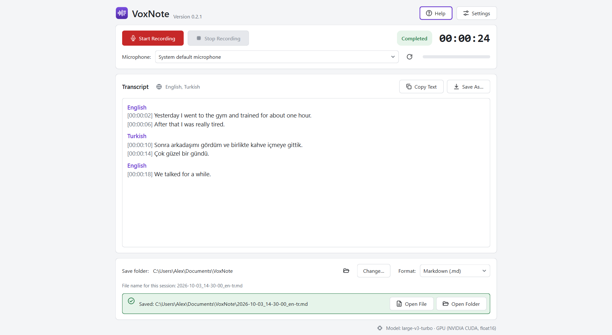
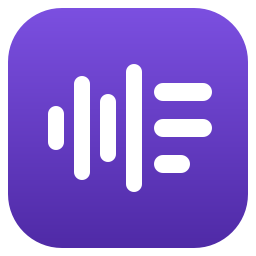

# Design Rationale

This document explains **why the VoxNote interface looks the way it does**.
Each decision is tied to a finding or guideline from the human-computer
interaction literature, listed under [References](#references).

Two things should be said first:

- **There is no single "most pleasing" interface in the literature.** Research
  does not hand out a finished layout. What it offers is a set of
  well-replicated regularities about how people read, aim, group and judge
  what they see. The interface was designed to respect those regularities.
- **The design has not been tested with users.** The principles below are
  evidence-based; whether this particular application of them works well for
  VoxNote's users still has to be shown by observation. See
  [UI_DESIGN_REVIEW.md](UI_DESIGN_REVIEW.md) for a self-assessment against
  Shneiderman's Eight Golden Rules.

- [The problem: a window that became too wide](#the-problem-a-window-that-became-too-wide)
- [Decision 1: a centred column with a maximum width](#decision-1-a-centred-column-with-a-maximum-width)
- [Decision 2: a limited line length in the transcript](#decision-2-a-limited-line-length-in-the-transcript)
- [Decision 3: related controls stay together](#decision-3-related-controls-stay-together)
- [Decision 4: low visual complexity and a familiar structure](#decision-4-low-visual-complexity-and-a-familiar-structure)
- [Decision 5: one accent colour, used sparingly](#decision-5-one-accent-colour-used-sparingly)
- [Decision 6: an icon that shows what the application does](#decision-6-an-icon-that-shows-what-the-application-does)
- [Decision 7: few choices on the surface](#decision-7-few-choices-on-the-surface)
- [What was deliberately not done](#what-was-deliberately-not-done)
- [References](#references)

## The problem: a window that became too wide

In version 0.2.0 every element stretched to the full width of the window. At
the default window size that looked fine. Maximised on a 1920-pixel screen it
did not:

- the microphone list became about 1,400 pixels wide for a text of 25
  characters,
- the *Start Recording* button sat at the far left and the timer and status
  at the far right, more than 1,500 pixels apart,
- *Copy Text* and *Save As…* were a full screen width away from the
  transcript heading they belong to,
- a long transcript line could run across the whole screen,
- the model information sat alone in the bottom-right corner.

The window looked "stretched" because the *content* did not need that much
room; only the *empty space between* things grew. Three separate findings
explain why this is unpleasant and slower to use.

| Finding | What it predicts for a stretched window |
| --- | --- |
| **Fitts's law** (Fitts, 1954): the time to reach a target grows with its distance and shrinks with its size. | Moving between *Start*, the status and the output buttons takes longer the further apart they are. Wider controls do not compensate, because the buttons themselves did not grow. |
| **Gestalt principle of proximity** (Wertheimer, 1923): elements that are close together are perceived as belonging together. | Controls that belong together but are far apart stop reading as a group. The eye has to search for the status instead of finding it next to the button that changes it. |
| **Line length and reading** (Dyson & Haselgrove, 2001; WCAG 2.2, criterion 1.4.8): comprehension was best at about 55 characters per line and worse at 100; the accessibility guideline sets 80 characters as the maximum. | A transcript line spanning a full-HD screen is far beyond what is comfortable to read; the eye loses its place when returning to the start of the next line. |

## Decision 1: a centred column with a maximum width

**What.** All content sits in a column that grows with the window up to
960 pixels and is then centred, with empty margins on both sides
(`MAX_CONTENT_WIDTH` in `app/main_window.py`). Extra *height* is still given
to the transcript, because more visible lines are useful.

**Why.** The maximum width keeps pointer travel short (Fitts) and keeps
related controls visibly together (proximity), whatever the screen size. It is
the same approach that platform guidelines recommend for large screens, where
content is given a maximum width and margins instead of being stretched
(Material Design 3, "Applying layout"; Apple Human Interface Guidelines,
"Layout"). Centring, rather than left-aligning, keeps the content in the
middle of the user's field of view on wide monitors.

**Why 960 pixels.** It is wide enough for the widest row of the interface
(save folder, change button and format list), and it is close to the default window width, so
maximising the window changes the surroundings but not the arrangement the
user has learned.

The footer with the model information is part of the column for the same
reason: it was moved out of the window's status bar so that it stays next to
the content.

## Decision 2: a limited line length in the transcript

**What.** Transcript lines wrap at 80 characters at the latest, even when the
text area is wider (`TranscriptView` in `app/main_window.py`). In narrower
windows the text simply follows the window width.

**Why.** Dyson and Haselgrove (2001) measured reading from screen at 25, 55
and 100 characters per line: the medium length gave the best comprehension,
and 100 characters the worst. WCAG 2.2 criterion 1.4.8 (level AAA) asks for
no more than 80 characters per line. Typographic practice gives a similar
range of 45 to 75 characters (Bringhurst, 2004). Eighty is the upper end of
what these sources accept; it was chosen over 55 because transcript entries
are short, timestamped units rather than continuous prose, and wrapping them
early would waste vertical space.

## Decision 3: related controls stay together

**What.**

- *Start*, *Stop*, the status and the timer share one row: the action and its
  feedback are seen together.
- *Copy Text* and *Save As…* sit in the transcript heading, because they act
  on the transcript.
- *Open File* and *Open Folder* appear inside the "Saved" message, at the
  moment and place where they are needed, instead of as permanently disabled
  buttons elsewhere.
- Explanations sit directly under the setting they explain.
- Each setting exists in one place only.

**Why.** Proximity (Wertheimer, 1923) lets the layout itself communicate what
belongs together, without lines or labels. Placing a follow-up action where
the result appears also shortens the path to it (Fitts, 1954). Removing
permanently disabled controls follows the "aesthetic and minimalist design"
heuristic: every extra element competes with the relevant ones for attention
(Nielsen, 1994).

## Decision 4: low visual complexity and a familiar structure

**What.** Three plain cards in the order of the workflow (record, read,
save); one typeface; a restrained palette; no decoration, gradients or
illustrations inside the window; a conventional arrangement with the title at
the top left and settings at the top right.

**Why.** People form a stable aesthetic judgement of an interface within
about 50 milliseconds (Lindgaard et al., 2006). Those first impressions are
most favourable for designs with **low visual complexity** and **high
prototypicality**, that is, designs that look the way people expect this kind
of thing to look (Tuch et al., 2012; Reinecke et al., 2013). The judgement
matters beyond looks: interfaces that are perceived as attractive are also
perceived as easier to use, the "aesthetic-usability effect" (Kurosu &
Kashimura, 1995; Tractinsky, Katz & Ikar, 2000).

## Decision 5: one accent colour, used sparingly

**What.** Neutral greys for surfaces and text, and a single accent colour,
violet, for the primary action in dialogs, focus rings, language headings and
the logo. Three further colours are reserved for meaning and are never used
decoratively: red for recording and errors, amber for work in progress and
warnings, green for success.

**Why a single accent.** Colourfulness is, next to complexity, the second
measurable driver of first impressions; moderate colourfulness is rated
better than high colourfulness (Reinecke et al., 2013). Reserving the
remaining colours for states keeps them informative.

**Why violet, and what the literature says about it.** Studies of colour
preference find that, on average, blues are liked most and dark yellows
least, with other cool hues such as cyan and purple also rated well (Palmer &
Schloss, 2010). On preference alone, blue would have been the obvious choice,
and the first version used it. Blue was dropped as a deliberate identity
decision by the project owner: it is the default of a great many applications
and did not give VoxNote a recognisable character. Violet was chosen because

- it is a cool hue from the well-liked part of the spectrum,
- it is clearly distinct from the three state colours, so the accent can
  never be mistaken for "recording", "warning" or "saved",
- it reaches the required contrast as text and as a button background.

Contrast ratios of the theme colours, calculated with the WCAG formula:

| Pair | Light | Dark |
| --- | --- | --- |
| Body text on window | 15.2 : 1 | 14.0 : 1 |
| Secondary text on card | 6.0 : 1 | 6.3 : 1 |
| Button label on accent | 6.4 : 1 | 6.7 : 1 |
| Accent text on its tinted background | 5.6 : 1 | 5.7 : 1 |
| Accent text on a field | 6.4 : 1 | 5.9 : 1 |

All are above the 4.5 : 1 that WCAG 2.2 criterion 1.4.3 requires for normal
text.

## Decision 6: an icon that shows what the application does

**What.** The icon shows a sound waveform on the left that turns into lines
of text on the right, in white on a violet tile.

**Why.** The first icon, a microphone on a blue tile, said "audio" but not
"transcription", and looked like the icon of any recording tool. The aim of
the new drawing is to depict the function rather than a generic object of
the category: speech becomes writing.

How it was made usable at every size:

- it is drawn as vectors on a 256-unit grid and rendered separately for nine
  sizes from 16 to 256 pixels, not scaled down from one bitmap;
- below 40 pixels a simplified version with three bars and two lines is used,
  because four bars and three lines merge into a blur at 16 pixels;
- it uses two flat tones only, so it stays legible on light and dark
  taskbars.

The drawing code is `paint_logo` in `tools/make_icon.py`.

## Decision 7: few choices on the surface

**What.** The main window offers two primary actions. Settings are split
into three tabs with at most five visible items; four rarely used
speech-detection values are folded away under "Advanced options".

**Why.** The time needed to choose grows with the number of alternatives
(Hick, 1952). Showing only what most people need, and keeping the rest one
step away ("progressive disclosure"), makes the common path fast without
removing control from experienced users, which is also what Shneiderman's
rules on universal usability and reducing memory load ask for.

## What was deliberately not done

- **No golden-ratio proportions.** There is no reliable evidence that
  golden-ratio layouts are preferred; the proportions follow content and
  measure instead.
- **No animation or motion effects.** They add visual complexity and were not
  needed to explain a state change.
- **No custom window chrome or non-standard controls.** Familiar platform
  controls support prototypicality and keyboard and assistive-technology
  behaviour.
- **No claim of optimality.** Width, line length and colour values are
  reasoned choices inside ranges the literature supports, not measured optima
  for this application.

## References

- Bringhurst, R. (2004). *The Elements of Typographic Style* (3rd ed.).
  Hartley & Marks.
- Dyson, M. C., & Haselgrove, M. (2001). The influence of reading speed and
  line length on the effectiveness of reading from screen. *International
  Journal of Human-Computer Studies, 54*(4), 585–612.
- Fitts, P. M. (1954). The information capacity of the human motor system in
  controlling the amplitude of movement. *Journal of Experimental Psychology,
  47*(6), 381–391.
- Hick, W. E. (1952). On the rate of gain of information. *Quarterly Journal
  of Experimental Psychology, 4*(1), 11–26.
- Kurosu, M., & Kashimura, K. (1995). Apparent usability vs. inherent
  usability. *CHI '95 Conference Companion*, 292–293.
- Lindgaard, G., Fernandes, G., Dudek, C., & Brown, J. (2006). Attention web
  designers: You have 50 milliseconds to make a good first impression!
  *Behaviour & Information Technology, 25*(2), 115–126.
- Nielsen, J. (1994). Enhancing the explanatory power of usability
  heuristics. *CHI '94 Proceedings*, 152–158.
- Palmer, S. E., & Schloss, K. B. (2010). An ecological valence theory of
  human color preference. *Proceedings of the National Academy of Sciences,
  107*(19), 8877–8882.
- Reinecke, K., Yeh, T., Miratrix, L., Mardiko, R., Zhao, Y., Liu, J., &
  Gajos, K. Z. (2013). Predicting users' first impressions of website
  aesthetics with a quantification of perceived visual complexity and
  colorfulness. *CHI '13 Proceedings*, 2049–2058.
- Shneiderman, B., Plaisant, C., Cohen, M., Jacobs, S., Elmqvist, N., &
  Diakopoulos, N. (2016). *Designing the User Interface* (6th ed.). Pearson.
- Tractinsky, N., Katz, A. S., & Ikar, D. (2000). What is beautiful is
  usable. *Interacting with Computers, 13*(2), 127–145.
- Tuch, A. N., Presslaber, E. E., Stöcklin, M., Opwis, K., & Bargas-Avila,
  J. A. (2012). The role of visual complexity and prototypicality regarding
  first impression of websites. *International Journal of Human-Computer
  Studies, 70*(11), 794–811.
- Wertheimer, M. (1923). Untersuchungen zur Lehre von der Gestalt II.
  *Psychologische Forschung, 4*, 301–350.
- W3C (2023). *Web Content Accessibility Guidelines (WCAG) 2.2*, success
  criteria 1.4.3 (Contrast, Minimum) and 1.4.8 (Visual Presentation).
- Google. *Material Design 3: Applying layout.* Apple. *Human Interface
  Guidelines: Layout.*
