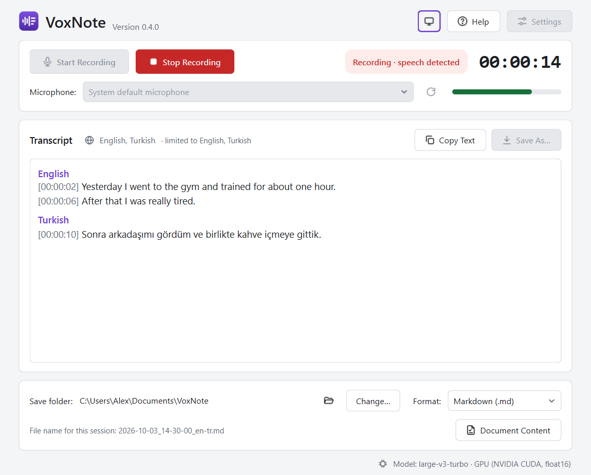

# Interface Design Review

This document reviews the VoxNote interface against **Ben Shneiderman's
Eight Golden Rules of Interface Design**. For each rule it lists what the
interface does, where that can be seen, and what is still weak. The review
is a self-assessment by the developer based on the implemented windows; it
is not the result of a usability study with real users.

The reasoning behind the layout, colours and icon, with references to the
literature, is in [DESIGN_RATIONALE.md](DESIGN_RATIONALE.md).

Version 0.2.0 addressed several weaknesses of the first version: disabled
buttons that were permanently on screen were removed, the microphone setting
was no longer duplicated, the settings dialog stopped showing large empty
areas, icons were added, and a Help window was introduced.

| # | Rule | Assessment |
| --- | --- | --- |
| 1 | Strive for consistency | Good |
| 2 | Seek universal usability | Partly met |
| 3 | Offer informative feedback | Good |
| 4 | Design dialogs to yield closure | Good |
| 5 | Prevent errors | Good, with one gap |
| 6 | Permit easy reversal of actions | Partly met |
| 7 | Keep users in control | Good |
| 8 | Reduce short-term memory load | Good |

## 1. Strive for consistency

**What the interface does**

- One set of colour tokens (`app/theme.py`) drives every window in both the
  light and the dark variant. A colour always means the same thing: red is
  recording or an error, amber is work in progress or a warning, green is
  success, violet is the accent and "ready".
- Four button styles only: the violet primary button (*Start Recording* and confirming actions such as
  *Save*), the red *Stop Recording* button, neutral buttons, and borderless icon buttons
  for small secondary actions (refresh, open folder).
- One icon set (`app/icons.py`) drawn in a single style and stroke width. The
  same icon always means the same thing: the folder icon opens a folder
  everywhere, the download arrow saves.
- The same word is used for the same thing everywhere: "Save folder", "File
  name" and "Format" are identical in the main window, the Settings dialog
  and the documentation.
- Each setting has one home. The microphone is chosen in the main window only
  and is not repeated in Settings.
- Buttons that open another dialog end with an ellipsis (*Change…*, *Browse…*,
  *Save As…*); buttons that act immediately do not.
- Layout follows one pattern: label on the left, control in the middle,
  related action on the right. Explanations sit directly under the control
  they belong to, in the same smaller grey type.
- All messages are produced from one table of error codes
  (`error_text` in `app/main_window.py`), so the same problem is always
  described with the same words.
- Dialog buttons follow the Windows order (confirm, then cancel).

**Weaknesses**

- Names of spoken languages ("English, Turkish") are always shown in English,
  even when the interface is in another language. This matches the exported
  files but is inconsistent with the surrounding interface text.
- Exported documents always use English headings.

## 2. Seek universal usability

**What the interface does**

- **New users get a five-step introduction** on first start; it never
  reappears unasked and stays available under Help.
- **Help is one key away.** `F1` opens answers to common questions in the
  interface language.
- **Novices** can ignore everything except two large buttons. The empty
  transcript area says what to do ("Press 'Start Recording' to begin").
  Sensible defaults mean no configuration is required.
- **Frequent users do not need the window at all:** a global shortcut and an
  edge bar start and stop recordings from any application.
- **Frequent users** have keyboard shortcuts for every main action
  (`Ctrl+R`, `Ctrl+E`, `Ctrl+Shift+S`, `Ctrl+Shift+C`, `Ctrl+O`, `Ctrl+,`),
  shown in the tooltips so they can be discovered. Microphone, format and
  folder can be changed in the main window without opening Settings.
- **Advanced users** find the speech-detection parameters in Settings, each
  with a plain-language explanation. The four rarely needed ones are folded
  away under "Advanced options" so they do not burden everyone else.
- **International users:** six interface languages, with the interface
  language independent of the spoken language. Decimal separators and number
  formatting follow the system locale. Dates in file names and exports use
  the unambiguous ISO order (year-month-day).
- **Keyboard operation:** every control is reachable with `Tab`, has a
  visible focus ring, and labels are linked to their fields.
- **Visual:** light and dark variants; the user can follow the system or
  choose either one (`Ctrl+T`). Text
  contrast was computed for the theme colours: body text is above 12:1,
  secondary text above 5.5:1, and coloured status text on its tinted
  background between 4.5:1 and 7.7:1 in both variants. State is never shown
  by colour alone; the status pill always contains the state as text.
- **Assistive technology:** icon-like and non-text elements (status pill,
  timer, level meter, message close button) have accessible names.
- The window can be resized; long paths are shortened in the middle and
  shown in full as a tooltip. On large screens the content keeps a maximum
  width and the transcript a maximum line length, instead of stretching.

**Weaknesses**

- Not tested with a screen reader (Narrator, NVDA). New transcript lines are
  not announced automatically.
- Not tested with Windows high-contrast themes or at very large text scaling.
- Disabled controls have a contrast of about 2.6–2.9:1. This is common
  practice and permitted by WCAG for inactive controls, but they are harder
  to read.
- No right-to-left interface languages.
- The interface has not been evaluated with real users of different
  abilities.

## 3. Offer informative feedback

**What the interface does**

- **Every state is visible.** The status pill names the state (Ready,
  Recording, Processing speech, Saving file, Completed, Error) and changes
  colour with it.
- **Recording is unmistakable:** the pill turns red, the timer counts, and
  the level meter moves with the voice.
- **The user can see that they are being heard:** the meter turns green and
  the pill reads "Recording · speech detected" while speech is captured.
- **Progress while waiting:** after Stop the pill shows how many seconds of
  speech remain to be processed. During start-up the status bar shows what
  the model is doing (checking, downloading with megabytes received,
  loading) next to an activity indicator.
- **The transcript grows utterance by utterance**, with the language and the
  time of each line.
- **Results are explicit:** after saving, a green message with a check mark
  shows the complete path. Messages carry an icon for their kind (information,
  success, warning, error) in addition to their colour. Quick actions (copy, folder changed, settings saved) are confirmed in
  the status bar.
- **Problems are explained in plain language**, with the likely cause and
  the next step ("Check that it is not muted and that Windows allows desktop
  apps to use the microphone"). Technical details go to the log file rather
  than the screen.
- **The device in use is always shown** (GPU or CPU), with the reason in a
  tooltip when the GPU could not be used.
- Disabled buttons explain themselves: the tooltip of a disabled *Start
  Recording* says what it is waiting for.

**Weaknesses**

- Text appears only after an utterance ends, so there is a delay of a pause
  plus recognition time. There are no word-by-word partial results.
- The model download shows megabytes received, not a percentage or time
  estimate.
- There is no sound or system notification when a long session finishes
  processing while the window is in the background.

## 4. Design dialogs to yield closure

**What the interface does**

- A session has a clear beginning, middle and end:
  **Ready → Recording → Processing speech → Saving file → Completed.**
  The final state is named "Completed", shown in green, and the saved-file
  message itself contains the buttons for the obvious next steps (*Open File*,
  *Open Folder*).
- A session without speech also ends clearly: "No speech was detected, so no
  file was created."
- Settings end with *Save* or *Cancel*, followed by "Settings saved." in the
  status bar.
- Recovery after a crash ends with the same saved-file message as a normal
  session.
- Closing the window during a recording offers "Stop, Save and Close": the
  window closes by itself once the file has been written.

**Weaknesses**

- After "Completed" the previous transcript stays on screen until the next
  recording starts. This is intended (it can still be copied or saved in
  another format), but there is no explicit "new session" action.

## 5. Prevent errors

**What the interface does**

- **Impossible actions are disabled, not punished.** *Start* is disabled
  while recording or processing; *Stop* is disabled when nothing is
  recording; Settings and the microphone list are locked during a session;
  *Open File* is not offered until there is a file to open. A second recording cannot be
  started.
- **Selection instead of typing** wherever possible: microphone, format,
  language and device are lists; the folder is chosen with the system folder
  dialog; numbers are spin boxes limited to valid ranges.
- **The file name template is validated while typing**, with a live preview.
  An unknown placeholder or unclosed bracket is described under the field and
  *Save* is disabled until it is fixed.
- **Invalid file name characters cannot cause a failure**: they are replaced
  automatically, and reserved Windows names are avoided.
- **Existing files cannot be overwritten by accident**: automatic saving adds
  a numeric suffix instead.
- **The save folder is checked before recording starts**, not after the user
  has spoken. A missing folder is created; an unusable one is reported with a
  button to choose another.
- **A new folder path in Settings** triggers the question "Create it?".
- **Destructive steps ask first:** starting a new recording over an unsaved
  transcript, and closing during a recording.
- **A missing microphone falls back** to the system default instead of
  failing.
- Constraints of the recogniser are handled internally: speech is cut before
  the 30-second model limit without user involvement.

**Weaknesses**

- **The input level can only be checked while recording.** A user cannot
  confirm that the microphone works before starting a session. This is a
  deliberate privacy choice (the microphone is opened only between Start and
  Stop), and a silent microphone is reported after three seconds, but a
  dedicated "test microphone" action would prevent wasted recordings.
- Recognition errors themselves cannot be prevented by the interface. The
  language restriction and the vocabulary list reduce them, but the user has
  to know they exist; the Help window points to them.
- Advanced speech-detection values can be set to combinations that work
  poorly (for example a very high sensitivity threshold); only ranges are
  enforced.

## 6. Permit easy reversal of actions

**What the interface does**

- **Settings are not applied until *Save*.** *Cancel* (or `Esc`) discards
  every change. *Restore Defaults* only fills the form and can itself be
  cancelled.
- **A failed save is not final.** The transcript stays; *Save* retries and
  *Save As…* writes it elsewhere, in any format.
- **A wrong format or folder is easy to correct** after the fact: *Save As…*
  exports the same session again.
- **Closing with an unsaved transcript is recoverable:** it is offered again
  on the next start. The same applies after a crash.
- The recovery question offers *Decide Later*, so even that decision can be
  postponed.
- Messages can be dismissed and do not change any state.

**Weaknesses**

- **A recording cannot be paused and resumed**, and Stop cannot be undone; a
  new session must be started.
- **"Discard" is permanent.** There is no undo for discarding an unsaved
  transcript or a recovery journal (it asks first, but cannot be reversed).
- **The transcript cannot be edited** in the application. This follows from
  the goal of a faithful transcript, but it also means a wrongly recognised
  segment cannot be removed before saving.
- Files that were saved are not deleted or replaced by the application; the
  user has to manage unwanted exports in the file manager.

## 7. Keep users in control

**What the interface does**

- **Nothing starts by itself.** The microphone is opened only when the user
  presses Start and released when they press Stop.
- **The user decides what a document contains** (layout, headings, each
  metadata row), also during a recording.
- **The user decides where files go**, what they are called and which format
  they have, and can change each of these at any time, including after the
  recording.
- **Appearance is the user's choice** (system, light or dark) and can be
  changed at any moment, including during a recording.
- **The device and the speech model can be chosen** instead of being imposed,
  and so can the languages recognition may use.
- **No modal interruptions for information.** Notices and errors appear
  inline and never block input. Modal questions are reserved for three
  decisions that must not be skipped.
- **The interface stays responsive**: loading, recognition and saving run in
  the background, so the window can always be moved, resized and operated.
- **No surprises with data:** nothing is uploaded, raw audio is not kept
  unless the user switches it on, and the Settings dialog states this.
- The application never changes the user's text.

**Weaknesses**

- **Automatic saving cannot be switched off.** Every session with speech
  produces a file.
- **Recording stops automatically** in two situations (microphone lost,
  recognition backlog of more than 20 minutes). Both are explained, and no
  data is lost, but the user did not initiate the stop.
- Loading the model cannot be cancelled.

## 8. Reduce short-term memory load

**What the interface does**

- **An active language restriction is shown** next to the detected languages,
  so the user does not have to remember a setting made earlier.
- **Everything relevant to the next recording is visible at once:** which
  microphone, which folder, which format, which file name, which model and
  device.
  Nothing has to be remembered from the Settings dialog.
- **Recognition over recall:** options are chosen from lists; the file name
  placeholders are listed under the template field; the preview shows the
  result instead of requiring the user to work it out.
- **The saved path is shown in full** and can be selected and copied; *Open
  File* and *Open Folder* remove the need to remember it at all.
- **Elapsed time and detected languages** are displayed continuously.
- **Preferences persist** between sessions.
- The main window has a small number of grouped areas (recorder, transcript,
  output) in the order of the workflow; Settings is split into three tabs of
  at most five visible items, and the window is only as tall as the selected
  tab.
- Shortcuts do not have to be memorised: they are shown in tooltips.

**Weaknesses**

- There is no history of earlier sessions inside the application; finding an
  older transcript means looking in the save folder.
- The meaning of the speech-detection settings has to be read from the
  explanatory text each time; there are no presets such as "quiet room" or
  "noisy room".

## Summary of improvement candidates

In rough order of value for users:

1. A microphone test before recording (rule 5).
2. Screen-reader testing and announcement of new transcript lines (rule 2).
3. Pause and resume (rule 6).
4. Localised names for spoken languages (rule 1).
5. A notification when processing finishes in the background (rule 3).
6. Presets for the speech-detection settings (rule 8).
7. An option to switch off automatic saving (rule 7).

None of these is required for the core workflow, and several were left out
deliberately to keep the first version small.
