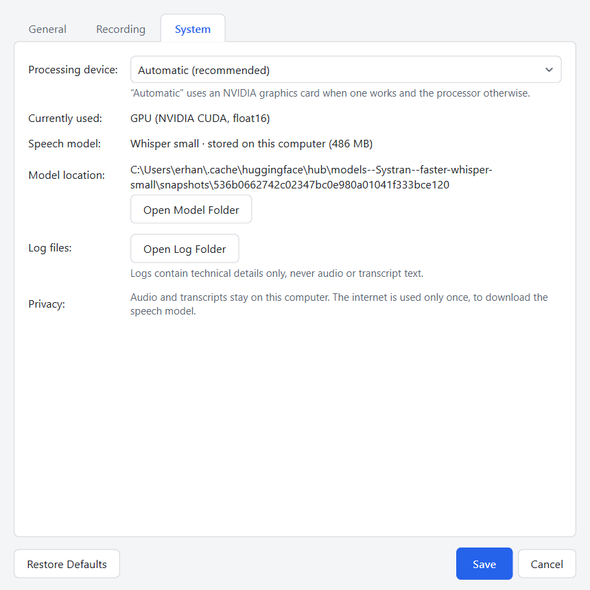

# User Guide

- [The main window](#the-main-window)
- [Starting and stopping a recording](#starting-and-stopping-a-recording)
- [What the status means](#what-the-status-means)
- [Choosing a microphone](#choosing-a-microphone)
- [How speech is split into segments](#how-speech-is-split-into-segments)
- [Understanding detected languages](#understanding-detected-languages)
- [Changing the save folder](#changing-the-save-folder)
- [Changing the file name](#changing-the-file-name)
- [Selecting the export format](#selecting-the-export-format)
- [Finding and opening exported files](#finding-and-opening-exported-files)
- [If saving fails](#if-saving-fails)
- [Recovering a session after a crash](#recovering-a-session-after-a-crash)
- [Settings reference](#settings-reference)
- [Keyboard shortcuts](#keyboard-shortcuts)
- [Working offline](#working-offline)
- [Tips for good results](#tips-for-good-results)

## The main window

From top to bottom:

1. **Header** – application name, version and the **Settings** button.
2. **Recorder** – the **Start Recording** and **Stop Recording** buttons, the
   current status, the elapsed time, the microphone selection and the input
   level meter.
3. **Transcript** – the text recognised so far, grouped by language, and the
   list of languages detected in this session.
4. **Output** – the save folder, the file format, the file name that will be
   used, the result of the last save and buttons to open the file or folder.
5. **Status bar** – short confirmations on the left; on the right, the speech
   model and the device it runs on.

Messages that need your attention appear as a coloured bar below the header
(problems with the microphone or the model) or in the Output section (results
of saving). They do not block the window.

## Starting and stopping a recording

1. Wait until the status shows **Ready** and the status bar shows the model,
   for example `Model: small · GPU (NVIDIA CUDA, float16)`. While the model is
   loading, **Start Recording** is disabled; its tooltip tells you why.
2. Press **Start Recording** or `Ctrl+R`. The status changes to **Recording**
   and the timer starts.
3. Speak. The level meter moves with your voice and turns green while speech
   is detected. Each time you pause, the utterance you just finished is
   recognised and added to the transcript.
4. Press **Stop Recording** or `Ctrl+E`.
   - The microphone is released immediately.
   - Speech that was still being processed is **not** discarded: the status
     shows **Processing speech** until everything has been recognised.
   - The transcript is then saved automatically (**Saving file**) and the
     status changes to **Completed**. The Output section shows the full path
     of the new file.

Only one recording can run at a time. While a recording is running or being
processed, **Start Recording**, the microphone selection and **Settings** are
disabled.

Closing the window during a recording asks whether to stop and save first.
Nothing is thrown away without asking.

## What the status means

| Status | Meaning |
| --- | --- |
| Ready | Nothing is running. You can start a recording. |
| Recording | The microphone is open and VoxNote is listening. |
| Recording · speech detected | Speech is being captured right now. |
| Processing speech | Recording has stopped; remaining speech is being recognised. If more than a second of speech is waiting, the remaining amount is shown. |
| Saving file | The transcript is being written to disk. |
| Completed | The session is finished. Either a file was saved (its path is shown) or no speech was detected and no file was created. |
| Error | Something failed. A message explains what happened and what you can do. The transcript, if any, is still available. |

## Choosing a microphone

The **Microphone** list in the main window shows all input devices.

- **System default microphone** follows the device selected in the Windows
  sound settings. This is the initial choice.
- Select a specific device to always use it, even when the Windows default
  changes.
- **Refresh** looks for devices that were connected after VoxNote started.
- If the selected microphone is not connected when you start a recording,
  the system default is used instead.

Your choice is remembered. The same setting is available in
**Settings › Recording**.

Use the **Input level** meter to check that the right microphone is active:
it should move clearly when you speak. If it stays empty, see
[TROUBLESHOOTING.md](TROUBLESHOOTING.md#microphone-problems).

## How speech is split into segments

VoxNote listens for speech and ignores silence.

- An utterance **starts** when speech is detected. A short stretch of audio
  from just before that moment is included, so the first syllable is complete.
- **Short pauses** (by default up to 0.8 seconds) stay inside the utterance.
- The utterance **ends** after a longer pause. It is then recognised and
  appears in the transcript, with the time at which it started.
- Sounds shorter than a quarter of a second, such as a click, are ignored.
- If you speak for a long time without pausing, the utterance is cut at the
  next short pause once it approaches 28 seconds, because the recognition
  model works on at most 30 seconds at a time.

If your sentences are split too often, increase **Pause that ends a
segment** in **Settings › Recording**. If text appears too late, decrease it.

## Understanding detected languages

VoxNote does not ask which language you speak. For every utterance the model
estimates the language and the utterance is written in that language.

- The transcript shows a heading with the language name each time the
  language changes.
- **Languages:** above the transcript lists every language of the session, in
  the order in which each was first detected with confidence. The same list is
  written into the exported file.
- You can switch languages between utterances. Make a short pause when you
  switch, so that the two languages end up in separate utterances.

Things to know:

- Detection works per utterance. A sentence that mixes two languages is
  treated as one language, and words from the other language may come out
  translated or garbled.
- One-word utterances are hard to identify. When the model is unsure, VoxNote
  prefers a language that was already used in the session, as long as the
  model considers it plausible. This avoids random switches to unrelated
  languages, but it cannot make a short utterance reliable.
- The interface language (Settings › General) has no influence on recognition.

## Changing the save folder

Quick way: press **Change…** next to **Save folder** in the main window and
pick a folder.

In **Settings › General › Save folder** you can also type a path or press
**Browse…**.

- The folder is checked when you confirm. If it does not exist, VoxNote
  offers to create it. If it cannot be written to, you are told and the
  setting is not accepted.
- The folder is remembered between starts.
- The initial folder is `VoxNote` inside your Documents folder, wherever
  Windows keeps it (including a Documents folder moved to OneDrive).
- If the folder becomes unavailable later (for example a removed USB drive),
  VoxNote reports this when you press **Start Recording**, before you speak,
  and offers to choose another folder.

## Changing the file name

**Settings › General › File name** contains a template. Placeholders in curly
brackets are replaced when a file is saved:

| Placeholder | Replaced with | Example |
| --- | --- | --- |
| `{date}` | Date the session started | `2026-10-03` |
| `{time}` | Time the session started | `14-30-00` |
| `{languages}` | Detected language codes, or `none` | `en-tr` |
| `{duration}` | Length of the recording | `00h05m24s` |
| `{session_id}` | Unique identifier of the session | `3f9a1c2e` |

The default template is `{date}_{time}_{languages}`, which produces names
such as `2026-10-03_14-30-00_en-tr.md`.

- You can add your own text: `interview_{date}` gives
  `interview_2026-10-03.md`.
- A **preview** below the field shows the resulting name as you type.
- An unknown placeholder or an unclosed bracket is reported immediately and
  **Save** is disabled until it is fixed.
- Characters that are not allowed in file names (`< > : " / \ | ? *`) are
  replaced with `_`. A template can never place a file outside the save
  folder.
- If a file with the same name already exists, a number is appended
  (`name_2.md`, `name_3.md`, …). Existing files are never overwritten by
  automatic saving.

## Selecting the export format

Choose the format in the **Format** list of the main window or in
**Settings › General › File format**: Markdown, plain text, JSON, Word or
PDF. The choice applies to the next automatic save and is remembered.

To get the same session in another format, use **Save As…** after the
recording: pick the format in the file dialog. You can do this as often as
you like until you start the next recording.

**Settings › General › Documents** offers two more options:

- *Show the time at the start of each transcript line* – adds `[00:01:23]`
  in front of every line (on by default).
- *Open the document after it has been saved* – opens the file with the
  program Windows associates with its type.

See [EXPORT_FORMATS.md](EXPORT_FORMATS.md) for what each format looks like.

## Finding and opening exported files

After a successful save, the Output section shows a green message with the
full path of the file.

- **Open File** opens it with the default program for its type.
- **Open Folder** (`Ctrl+O`) opens the folder in File Explorer with the file
  selected. Before any file was saved, it opens the save folder.
- **Copy Text** (`Ctrl+Shift+C`) copies the transcript text, without
  timestamps and headings, to the clipboard.

## If saving fails

If the file cannot be written (folder removed, no permission, disk full), the
status changes to **Error** and a message explains the reason. **Your
transcript is not lost:**

- it stays visible in the window,
- **Save** tries the configured folder again (after you fixed the problem or
  chose another folder with **Change…**),
- **Save As…** lets you choose any other place and format.

VoxNote never reports a file as saved unless it was written completely.

## Recovering a session after a crash

While you record, each recognised utterance is also written to a small
recovery file on your computer. If VoxNote or the computer stops
unexpectedly, the next start shows:

> *1 session(s) were not saved the last time the application ran. Do you want
> to recover and save them now?*

- **Recover and Save** loads the transcript and saves it using your current
  folder, file name and format settings.
- **Discard** deletes the recovery data permanently.
- **Decide Later** keeps it and asks again at the next start.

Speech that had been captured but not yet recognised at the moment of the
crash cannot be recovered, because audio is only kept in memory. The recovery
file is deleted automatically as soon as a session has been saved.

## Settings reference

Open with the **Settings** button or `Ctrl+,`. Changes take effect when you
press **Save**. **Cancel** discards them. **Restore Defaults** fills the form
with the default values but still needs **Save** to apply.

### General

| Setting | Description | Default |
| --- | --- | --- |
| Interface language | Language of menus and messages | English |
| Save folder | Where transcripts are saved automatically | `Documents\VoxNote` |
| File format | Format used for automatic saving | Markdown |
| File name | File name template | `{date}_{time}_{languages}` |
| Show the time at the start of each transcript line | Timestamps in the document and the preview | On |
| Open the document after it has been saved | Opens the file automatically | Off |

### Recording

| Setting | Description | Default | Range |
| --- | --- | --- | --- |
| Microphone | Input device | System default | |
| Pause that ends a segment | Silence needed to finish an utterance | 800 ms | 200–5000 ms |
| Speech sensitivity | Probability above which sound counts as speech. Lower = more sensitive. | 0.50 | 0.10–0.95 |
| Shortest speech | Utterances with less speech than this are ignored | 250 ms | 50–2000 ms |
| Longest segment | Length at which continuous speech is cut | 28 s | 5–30 s |
| Lead-in | Audio kept before detected speech | 300 ms | 0–1000 ms |
| Lead-out | Audio kept after speech ends | 300 ms | 0–1000 ms |
| Keep the raw audio of each session | Stores a WAV file per session for troubleshooting | Off | |

### System

| Item | Description |
| --- | --- |
| Processing device | Automatic (GPU if it works, otherwise CPU), GPU, or CPU |
| Currently used | The device and number format in use, and the reason if the GPU is not used |
| Speech model | Whether the model is on this computer, and its size |
| Model location | Folder of the model; **Open Model Folder** opens it |
| Log files | **Open Log Folder** opens the folder with `voxnote.log` |

Changing the processing device reloads the model, which takes a few seconds.

## Keyboard shortcuts

| Shortcut | Action |
| --- | --- |
| `Ctrl+R` | Start recording |
| `Ctrl+E` | Stop recording and save |
| `Ctrl+Shift+S` | Save As… |
| `Ctrl+Shift+C` | Copy transcript text |
| `Ctrl+O` | Open the folder of the saved file |
| `Ctrl+,` | Open Settings |
| `Tab` / `Shift+Tab` | Move between controls |
| `Space` / `Enter` | Activate the focused button |

## Working offline

After the model has been downloaded once, VoxNote needs no internet
connection. You can disconnect the computer from the network and record,
transcribe and export as usual. On start, VoxNote looks for the model on
disk first and does not contact any server when it is found.

## Tips for good results

- Use a headset or a microphone close to your mouth. Laptop microphones pick
  up room noise and fan noise.
- Speak in complete sentences and pause briefly between them.
- Pause when you change language.
- Avoid very short, isolated words when the language matters.
- In a noisy room, raise **Speech sensitivity** (for example to 0.6–0.7) so
  that noise is not mistaken for speech.
- If first or last syllables are missing, increase **Lead-in** or
  **Lead-out**.
